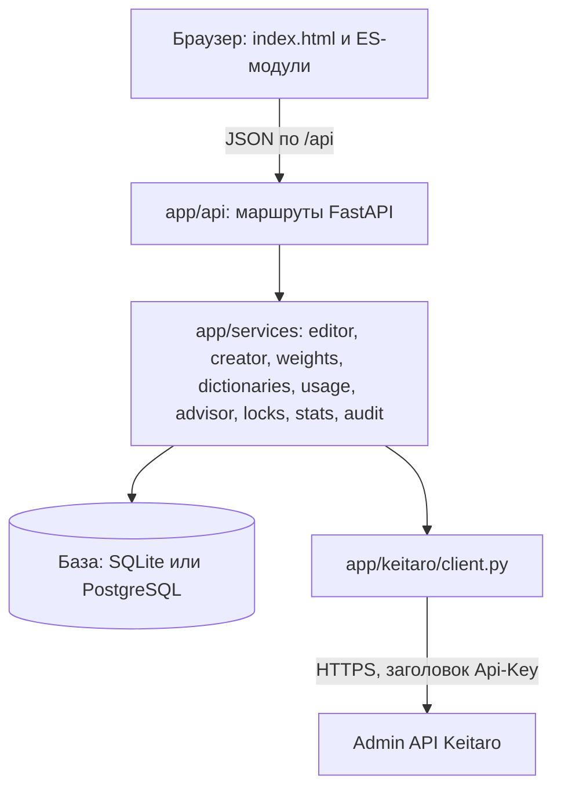
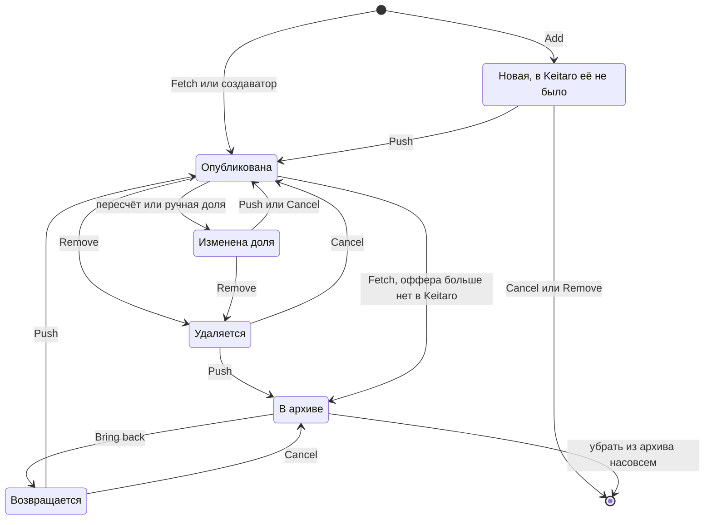
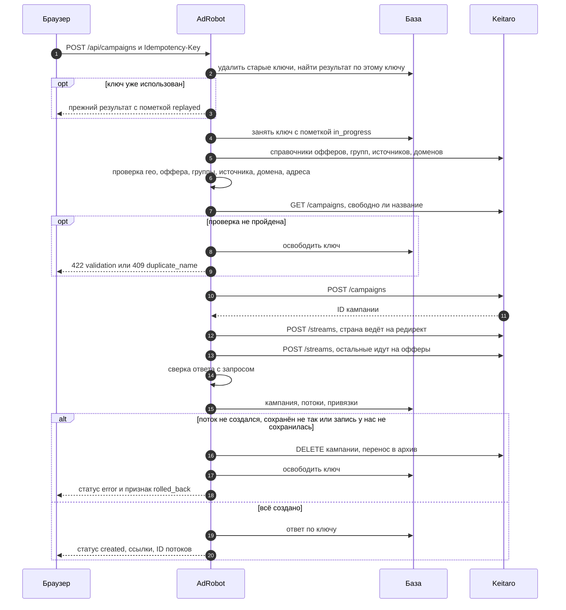
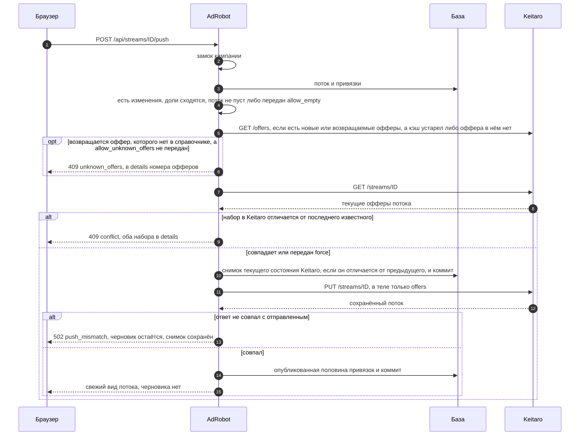

# Архитектура

Документ для того, кто будет читать код. Что умеет приложение, описано в [README](../README.md). Назначение каждой функции собрано в [FUNCTIONS.md](FUNCTIONS.md).

## Слои



| Слой | Где лежит | За что отвечает | Чего не делает |
|---|---|---|---|
| Интерфейс | `app/web/` | Рисует состояние, которое вернул сервер. Каждая кнопка вызывает один метод API | Не считает доли и не хранит черновик. Исключение одно: схема маршрута в форме создания прикидывает доли для показа |
| Маршруты | `app/api/` | Разбор запроса, проверка токена и роли, замок кампании, запись в журнал, выбор представления | Не содержит бизнес-правил |
| Сервисы | `app/services/` | Вся логика: черновик, пересчёт, публикация, сага создания, справочники, инструменты по многим кампаниям, советник, замки | Не знает про HTTP-ответы. Бросает `EditorError`, `CreatorError` и `LockBusyError` |
| Клиент Keitaro | `app/keitaro/` | Запросы, повторы, разбор ошибок всех форматов, справочник стран | Не знает про базу и правила редактора |
| База | `app/models.py`, `alembic/` | Зеркало кампаний и потоков и всё, чего в Keitaro нет: черновик, архив, закрепления, снимки, журнал, замки | Не хранит ключ API и токены |

Общие объекты создаются один раз при старте в `app/main.py`: клиент, `DictionaryService`, `CampaignCreator`, `CampaignLocks`. Маршруты получают их через зависимости из `app/api/deps.py`. Фабрика `create_app(settings, transport)` принимает подменный транспорт. Так тесты и демо-режим работают на эмуляторе без единого условия в боевом коде.

Маршрутов четыре группы: служебные (`routes_meta.py`), кампании (`routes_campaigns.py`), редактор потока (`routes_streams.py`) и инструменты (`routes_tools.py`). Инструменты подключаются раньше редактора: у них есть точные пути `/streams/drafts` и `/streams/push-many`, которые иначе перехватил бы шаблон `/streams/{stream_id}`.

Два метода живут прямо в `app/main.py`, вне групп. `GET /api/auth/mode` отвечает, нужен ли токен, и сам токена не требует: иначе интерфейс не узнал бы, что пора его спросить. `GET /api/auth/me` требует токен и возвращает `name` и `read_only`. Имя и роль кладёт в `request.state` зависимость `require_token`.

Перед маршрутами стоит одно middleware, `security_and_actor`. Оно делает три вещи. Первая: отклоняет изменяющий запрос к `/api/`, пришедший с чужого сайта, подробности в разделе [Защита от запросов с чужих сайтов](#защита-от-запросов-с-чужих-сайтов). Вторая: кладёт имя из заголовка `X-AdRobot-User` в контекстную переменную `current_actor`. Третья: ставит заголовки безопасности. CSP не ставится только страницам `/docs` и `/openapi.json`: Swagger UI запускается inline-скриптом. Если задана настройка `ALLOWED_HOSTS`, снаружи добавляется `TrustedHostMiddleware` из Starlette.

Интерфейс и страница `/docs` построены на относительных адресах, поэтому приложение работает и в корне сайта, и в подкаталоге за обратным прокси. Модуль `app/web/static/js/api.js` строит пути API от каталога, из которого открыт интерфейс. Настройка `ROOT_PATH` передаётся в `FastAPI(root_path=...)` и нужна только Swagger UI, когда прокси отрезает префикс. Файлы Swagger UI лежат в `app/web/static/vendor/swagger-ui/`, CDN странице `/docs` не нужен.

## Схема данных

Схему создают две миграции: `alembic/versions/20260918_0001_initial_schema.py` заводит основные таблицы, `alembic/versions/20260918_0002_campaign_locks.py` добавляет таблицу замков.

| Таблица | Смысл | Важные поля |
|---|---|---|
| `campaigns` | Кампания Keitaro, известная AdRobot | `keitaro_id` уникален. `origin` равен `adrobot` у созданных создаватором и `keitaro` у импортированных. `geo` заполняется только создаватором. `is_deleted` значит, что кампания пропала из трекера или ушла в архив. `streams_fetched_at` хранит время последнего Fetch |
| `streams` | Поток кампании | `keitaro_id` уникален. `schema` определяет редактируемость: офферы есть только у `landings`. `summary` хранит справку для показа, логика её не читает. `is_deleted` значит, что поток пропал из трекера |
| `stream_offers` | Привязка оффера к потоку, главная таблица логики | Уникальная пара `stream_id` и `offer_id`. Остальное описано ниже |
| `offers` | Кэш справочника офферов | Первичный ключ равен ID оффера в Keitaro. `is_missing` значит, что оффер был в справочнике, а в последней выдаче его нет |
| `stream_snapshots` | Снимок офферов потока в Keitaro перед публикацией | `offers` хранит список `{offer_id, share, state}`. На поток хранится `SNAPSHOTS_PER_STREAM` последних, по умолчанию 30. Снимок, равный предыдущему, второй раз не сохраняется |
| `operations` | Журнал операций | `action`, `actor`, `status`, номера кампании и потока в Keitaro, `summary`, `details`, `error`, `duration_ms` |
| `idempotency_records` | Защита создания от дублей | Первичный ключ равен ключу идемпотентности. `request_hash` и сохранённый `response`. Записи старше `IDEMPOTENCY_TTL_DAYS` удаляются при следующем создании |
| `campaign_locks` | Замок на кампанию между процессами | Первичный ключ `campaign_id`: строка означает «занято». `owner` хранит случайную метку владельца, `expires_at` хранит срок жизни замка |
| `app_settings` | Настройки из интерфейса | Пары ключ и значение для умолчаний создаватора |

Время везде хранится в UTC. Тип `UTCDateTime` возвращает время с поясом даже из SQLite, которая пояс теряет.

### Привязка оффера: две половины

У строки `stream_offers` две пары полей.

| Поля | Что значат | Кто меняет |
|---|---|---|
| `state`, `share`, `is_pinned` | Черновик: то, что пользователь видит в AdRobot | Add, Remove, Bring back, ручная доля, пересчёт, Cancel, откат, Fetch |
| `kt_state`, `kt_share`, `kt_binding_id` | Что опубликовано в Keitaro по последней синхронизации. `NULL` значит, что в трекере этой привязки нет | Только Fetch и успешный Push |

Состояний три. `active` участвует в ротации и в пересчёте. `disabled` значит, что оффер выключен в самом Keitaro: AdRobot передаёт его как есть и в расчёт не берёт. `removed` значит архив AdRobot: оффера нет в трекере, но его можно вернуть.

Поток жёлтый, когда половины расходятся хотя бы у одной привязки. Признак не хранится, он вычисляется свойством `StreamOffer.is_dirty`:

| Черновик | В Keitaro | Изменена? |
|---|---|---|
| `removed` | привязка есть | да, оффер исчезнет после Push |
| `removed` | привязки нет | нет, это спокойный архив |
| `active` или `disabled` | привязки нет | да, оффер появится после Push |
| `active` или `disabled` | привязка есть | да, если отличается состояние или доля |

Вычисляемый признак сам приходит в порядок. Добавил оффер и тут же убрал: поток снова чистый, хотя никто флаг не сбрасывал. У свойства есть SQL-двойник `DIRTY_BINDING` в `app/api/routes_campaigns.py`. Он ищет кампании с черновиками одним запросом.

Ещё два поля держат логику оригинала:

- `was_published` отвечает на вопрос, была ли привязка когда-нибудь в Keitaro. Cancel удаляет только те привязки, которых там не было. Так воспроизводится фраза из видео: «оффер останется, привязка удалится».
- `sort_index` хранит порядок активации. Новый оффер получает максимум плюс один. Оффер после Bring back тоже. Так же встаёт в конец оффер из архива, который вернули прямо в Keitaro: Fetch считает это той же активацией. По этому порядку раздаётся остаток от деления долей и строится тело Push. На экране порядок другой: по убыванию доли, при равенстве по `id` привязки. Поэтому возвращённый оффер встаёт на прежнее место в таблице, как в оригинале, а лишний процент достаётся ему.

Закрепление `is_pinned` в черновик не входит. Оно не делает поток жёлтым, не уходит в Keitaro, и Cancel не откатывает pin и unpin. Исключение одно. Если доля активной привязки в черновике отличается от опубликованной, Cancel вместе с долей снимает и закрепление. Ручной ввод доли закрепляет её сам, и без этого правила вернувшаяся после отмены доля осталась бы закреплённой и исказила бы следующий пересчёт. Remove флаг не сбрасывает: в расчёте участвуют только активные привязки, так что у удалённой он ни на что не влияет. Зато отмена Remove возвращает оффер таким, каким он был, с долей и с закреплением. Bring back флаг снимает: возвращённый оффер получает долю заново.

## Жизненный цикл привязки



Жёлтый поток дают состояния «Новая», «Изменена доля», «Удаляется» и «Возвращается». В интерфейсе они видны метками «новый», «вернётся», зачёркнутой прежней долей и серой строкой `removed`.

## Создание кампании: сага

Keitaro не даёт транзакций, а кампания состоит из трёх запросов. Поэтому сначала идут все проверки, а сбой после первого запроса компенсируется.



Детали, которых не видно на схеме:

- Проверки собирают все ошибки формы разом. Пользователь не чинит их по одной.
- Ключ занимается записью в базу раньше всех проверок и запросов в трекер. Два одновременных дубля упираются в уникальность первичного ключа, проходит один, второй получает `in_progress`. Отставший на долю секунды дубль тоже получает `in_progress`, а не «название занято» про собственную кампанию. При неудаче ключ освобождается, и попытку можно повторить с ним же.
- Проверка без создания (`dry_run`) ключ не занимает и прежний результат по нему не воспроизводит. Она заканчивается сразу после проверок: в ответ уходит план из трёх запросов, в Keitaro ничего не пишется. Иначе dry-run с ключом уже выполненного запроса показал бы «повтор» вместо плана.
- Ключи не копятся. При каждом создании с ключом удаляются записи старше `IDEMPOTENCY_TTL_DAYS`. Отметка «запрос выполняется», оставшаяся от упавшего процесса, считается живой пять минут. После этого она снимается, и запрос выполняется заново.
- `POST` после таймаута не повторяется. Создалась ли кампания, неизвестно, и сообщение прямо просит проверить трекер.
- Случайный alias при ответе «уже занят» генерируется заново, до четырёх попыток. Alias, заданный пользователем, не подменяется.
- Подстановка `{geo}` в названии работает всегда. Для одной страны это её код. Для одной кампании на несколько стран это коды через плюс: `AU+RO`. Без подстановки код страны дописывается к названию только при разбиении по странам, чтобы кампании различались. Суффикс ` [код]` ставится при `split_by_geo` всегда, даже когда страна одна. Причина: если из пачки «MX, AU» создалась только MX, повтор по одной AU должен дать то же имя `… [AU]`, а не кампанию без суффикса.
- При `split_by_geo` каждая кампания создаётся отдельной сагой. Ответ приходит с кодом 200 и статусом по каждой кампании: часть может создаться, часть нет. За один запрос создаётся не больше 30 кампаний.
- Сохранение кампании в базе AdRobot входит в сагу. Если оно упало, в трекере осталась бы кампания, о которой AdRobot не знает, а повтор упёрся бы в «название занято». Поэтому сбой локального сохранения компенсируется так же, как сбой потока: кампания уходит в архив.
- Любой сбой после создания кампании приходит с кодом `stream_creation_failed`, причина стоит в тексте. Это касается и несовпадения ответа с запросом: код `verify_failed` существует внутри саги, но наружу отдельным кодом не выходит.
- Если не удалась даже компенсация, сообщение называет номер кампании и просит удалить её вручную.

## Push to KT



Почему так:

- **В теле только `offers`.** `PUT /streams/{id}` обновляет лишь присланные поля. Фильтры, лендинги, позиция и название потока не трогаются. Цикл «прочитать весь объект и отправить обратно» не нужен, а вместе с ним исчезает риск затереть чужие правки в других полях.
- **Конфликт ищется по содержимому.** Сравниваются отсортированные тройки `(offer_id, share, state)`: что лежит в трекере сейчас и что мы видели при последней синхронизации. На отметки времени опираться нельзя: удалённый из потока оффер следа не оставляет.
- **Сначала Keitaro, потом база.** Опубликованная половина записывается только после успешного ответа и сверки. При любой ошибке поток остаётся жёлтым, Push можно повторить. Повтор `PUT` безопасен: тот же набор офферов даёт тот же результат.
- **Снимок фиксируется до отправки.** Он коммитится в базу раньше, чем уходит `PUT`. Если запрос применится, а ответ потеряется или окажется не тем, трекер уже изменён, и точка отката обязана существовать. Обратная сторона: после неудачного Push в истории может остаться снимок. Он описывает состояние трекера до попытки и ничему не мешает. Копии при этом не плодятся: перед сохранением снимок сравнивается с последним снимком потока, и одинаковый второй раз не пишется. Повтор Push после сбоя оставляет в истории одну запись. Лишние снимки сверх `SNAPSHOTS_PER_STREAM` удаляются после успешной публикации.
- **Невидимый оффер возвращается в черновик, но публикуется с подтверждением.** Ключу API могут быть видны не все офферы трекера. Если привязка уже бывала в Keitaro, её можно вернуть из архива: `editor._offer_problems` такой оффер пропускает. Но «не виден ключу» снаружи не отличить от «удалён в трекере», а Keitaro молча примет и несуществующий ID. Поэтому Push проверяет возвращаемые офферы ещё раз. Если оффера нет в справочнике или он помечен `is_missing`, ответ будет 409 `unknown_offers` с `details.needs = "allow_unknown_offers"` и списком `details.offer_ids`. Интерфейс показывает диалог подтверждения и повторяет Push с `allow_unknown_offers: true`. Оффер, который справочник знает как выключенный или удалённый, блокируется всегда, подтверждения для него нет. Добавить новый невидимый оффер нельзя: проверить его существование нечем.
- **Подтверждения устроены одинаково.** `empty_stream` просит `allow_empty`, `unknown_offers` просит `allow_unknown_offers`. В обоих случаях нужное поле названо в `details.needs`, а повторный запрос отличается от первого только этим полем. Массовая публикация подтверждений не передаёт: такой поток останется черновиком с причиной в ответе.
- **Остаётся одно окно.** Если `PUT` прошёл, а коммит в нашу базу нет, трекер уже обновлён, а мы об этом не знаем. Следующий Push увидит расхождение и сообщит о конфликте. Fetch с сохранением черновика сведёт состояния: черновик совпадёт с трекером, поток станет белым.

## Fetch при черновике: трёхстороннее слияние

Fetch без черновика зеркалит Keitaro. Если черновик есть, интерфейс спрашивает, сохранить его или сбросить. При сохранении функция `_sync_bindings` решает судьбу каждой привязки отдельно. Три стороны: черновик, последнее известное состояние трекера и его текущее состояние.

| Оффер в Keitaro сейчас | Привязка у нас | Черновик сохраняем | Черновик сбрасываем |
|---|---|---|---|
| есть | нет | Создаётся с состоянием и долей из Keitaro | То же |
| есть | не тронута | Принимает состояние и долю Keitaro | То же |
| есть | изменена | Черновик остаётся, обновляется только опубликованная половина | Всё берётся из Keitaro |
| нет | не тронута | Уходит в архив: `removed`, 0 %, закрепление снято | То же |
| нет | изменена | Черновик остаётся, опубликованная половина очищается. После Push оффер появится в трекере заново | Была в Keitaro: уходит в архив. Не была: удаляется |
| нет | уже в архиве | Остаётся в архиве | То же |

Следствия:

- Доли при Fetch не пересчитываются никогда. После слияния сумма может оказаться не 100. Пример: закреплённый и потому нетронутый оффер принял новую долю из трекера. Поток покажет проблему, Push будет закрыт до нажатия «Пересчитать».
- После Fetch опубликованная половина свежая, поэтому следующий Push конфликта не увидит.
- Закрепления живут только у нас, Fetch их не трогает. Исключение: оффер, ушедший в архив.
- Поток, пропавший из трекера, помечается `is_deleted`, но не удаляется. Править его нельзя.
- Фоновой синхронизации нет. Вместо неё интерфейс при открытии кампании сам выполняет Fetch, если данные старше двух минут. Это тот же запрос с сохранением черновика, поэтому чужие правки из трекера подтягиваются, а свои не теряются.

## Конкурентность

| Угроза | Защита |
|---|---|
| Двойной клик, две вкладки, два пользователя, два процесса правят одну кампанию | `CampaignLocks`: замок на кампанию. Под ним идут Fetch, каждая правка, применение совета, Push и архивация. Пересчёты выполняются строго по очереди |
| Двойной клик по Create, повтор после обрыва связи | Ключ идемпотентности, занятый до первого запроса в трекер |
| Кто-то правит поток в админке Keitaro, пока у нас черновик | Сверка перед Push, код `conflict` |
| Два запроса одновременно обновляют справочник офферов | Замок внутри `DictionaryService`: справочник грузит один запрос, остальные ждут и берут готовое |
| Слишком много запросов к трекеру разом | Семафор в клиенте, `KEITARO_MAX_CONCURRENCY`, по умолчанию 4 |
| Параллельная запись в SQLite | WAL, `busy_timeout` 5 секунд, внешние ключи включены |
| В автокомплите ответ на старый запрос пришёл позже нового | Интерфейс нумерует запросы и отбрасывает устаревшие ответы |
| Повторное нажатие кнопки во время операции | Кнопка блокируется до ответа сервера |

### Замок на кампанию

Замок живёт в `app/services/locks.py` и состоит из двух уровней.

1. `asyncio.Lock` внутри процесса. Это быстрый путь: он снимает гонки двойного клика и двух вкладок, не трогая базу лишний раз.
2. Строка в таблице `campaign_locks`. Первичный ключ равен ID кампании, поэтому вставить вторую строку нельзя. Кто вставил, тот и владеет замком. Этот уровень работает между процессами и серверами на общей базе.

Порядок захвата такой. Сначала удаляется просроченная строка этой кампании, затем вставляется своя со сроком жизни `LOCK_TTL`, это 10 минут. Если вставка упёрлась в занятый ключ или в занятую базу, попытка повторяется каждые 0,15 секунды. Ошибка «нет таблицы» занятостью не считается: она пробрасывается сразу, и пользователь получает подсказку выполнить `alembic upgrade head`, а не ждёт 20 секунд. Через 20 секунд ожидания бросается `LockBusyError`, маршрут отвечает 409 `campaign_busy`. После операции строка удаляется по метке владельца, причём удаление идёт под `asyncio.shield`: если запрос отменили, потому что пользователь закрыл вкладку, замок всё равно снимется, а не провисит до истечения срока. Если процесс убили посреди операции, строка останется, но следующий желающий увидит, что срок вышел, и заберёт замок.

Срок 10 минут взят с запасом под самую долгую операцию. Это Push: два чтения справочника офферов, `GET` и `PUT`, каждый с повторами и паузами. Срок обязан быть больше самой операции, иначе второй воркер войдёт в кампанию, пока первый ещё работает.

Замки в памяти не копятся. Каждый из них считает своих пользователей — тех, кто держит его сейчас, и тех, кто стоит в очереди. Когда не остаётся никого, замок выбрасывается из словаря. Иначе процесс, через который прошла тысяча кампаний, хранил бы тысячу объектов без дела.

Благодаря второму уровню приложение можно запускать в несколько воркеров: `uvicorn app.main:app --workers 4`. Общими остаются данные в базе: кампании, черновики, снимки, журнал, замки. У каждого воркера свои кэш справочников и семафор клиента. Расхождение кэша ограничено `DICTIONARY_TTL_SECONDS` и безвредно: перед записью в трекер оффер проверяется заново, а при промахе кэш перечитывается принудительно.

Массовые операции берут замок отдельно на каждую кампанию и отпускают его перед следующей. Занятая кампания не останавливает обход: поток получает статус «пропущен» с кодом `campaign_busy`.

## Обработка ошибок

Сервисный слой бросает исключения с машинным кодом и русским текстом. Обработчики в `app/main.py` приводят всё к одному виду:

```json
{"error": {"code": "invalid_distribution", "message": "Сумма долей 66%, а должна быть 100%.", "details": null}}
```

| Исключение | Откуда | Статус |
|---|---|---|
| `EditorError` | Редактор | Задаётся в месте ошибки: 404, 409, 422, 502 |
| `CreatorError` | Создаватор | 409, 422, 502. Список проблем формы лежит в `details.errors` |
| `KeitaroError` и наследники | Клиент | 404, 422, 502, 503, 504, таблица есть в [FUNCTIONS.md](FUNCTIONS.md#appkeitaroerrorspy) |
| `LockBusyError` | Замок кампании | 409, код `campaign_busy` |
| `RequestValidationError` | Схемы запросов | 422, код `validation` |
| `HTTPException` | В том числе проверка токена и роли: 401 без токена, 403 при токене только для чтения. Токен описан схемой безопасности `HTTPBearer`, поэтому в Swagger UI есть кнопка Authorize | Как задано, код `http_error` |
| `OverflowError` | Число в пути или параметре не помещается в колонку базы | 422, код `validation` |
| `OperationalError` | База | 503, код `database_error`. Для несозданных таблиц текст подсказывает `alembic upgrade head` |
| Любое другое | Где угодно | 500, код `internal_error`. Подробности пишутся только в лог сервера |

Коды редактора: `campaign_not_found`, `stream_not_found`, `binding_not_found`, `snapshot_not_found`, `stream_deleted`, `stream_without_offers`, `offer_already_in_stream`, `offer_not_usable`, `already_removed`, `not_removed`, `not_active`, `not_archived`, `no_active_offers`, `nothing_to_push`, `empty_stream`, `invalid_distribution`, `pinned_share`, `conflict`, `push_mismatch`. К ним добавляются коды калькулятора: `not_enough_for_free`, `pinned_sum_mismatch`, `pinned_out_of_range`, `share_out_of_range`, `unknown_item`.

Коды создаватора: `validation`, `duplicate_name`, `idempotency_mismatch`, `in_progress`, `alias_taken`, `stream_creation_failed`, `verify_failed`, `bad_response`, `bad_redirect_url`.

Коды Push, требующие отдельного подтверждения: `empty_stream` (нужен `allow_empty`), `unknown_offers` (нужен `allow_unknown_offers`), `conflict` (нужен `force` или Fetch).

Коды инструментов и защиты: `sync_running` — синхронизация всех кампаний уже идёт, второй запуск отклонён; `campaign_busy` — кампанию правит кто-то другой; `cross_site_request` — изменяющий запрос пришёл с чужого сайта.

Операции редактора и создаватора обёрнуты в `audited`. При ожидаемой ошибке он откатывает транзакцию, пишет запись в журнал со статусом `error` и передаёт исключение дальше. Поэтому неудачное добавление оффера не оставляет следов в базе, а в журнале видно, что и почему не получилось. Создание отвечает кодом 200 со статусами по кампаниям. Это осознанно: при отдельной кампании на каждую страну возможен частичный успех. В журнале картина честная. Если не создано ничего, запись получает статус `error` и текст ошибки. Если создана хотя бы одна кампания, запись успешная, а число ошибок стоит в сводке.

Статистика падает мягко. Любая ошибка отчёта даёт `available: false`, в колонках появляется прочерк, редактор работает дальше. Значения `nan` и `inf` в отчёте превращаются в ноль. Советник при недоступной статистике отвечает «статистика недоступна», а не ошибкой. То же с названиями офферов после Fetch: сбой справочника Fetch не роняет.

Просмотр не зависит от трекера. `GET /api/campaigns/{id}` и `GET /api/streams/{id}` читают только базу, поэтому кампания с черновиком открывается и при недоступном Keitaro. Адрес трекинг-домена для ссылки кампании берётся методом `DictionaryService.tracking_domain_url`, который в сеть не ходит.

Интерфейс разбирает особо несколько случаев: `conflict` открывает диалог с выбором, `empty_stream` просит отдельное подтверждение публикации пустого потока, `unknown_offers` показывает список офферов и спрашивает, публиковать ли их, `duplicate_name` просит подтверждения дубля, ответ 401 вызывает запрос токена. Остальное показывается тостом с текстом из `message`.

Схемы запросов ограничивают любой ID значением 2 147 483 647. Слишком большое число в теле получает 422 от схемы, в пути или параметре его ловит обработчик `OverflowError`. До базы такое число не доходит.

Текст ошибки трекера проходит через `KeitaroClient._scrub`. Если прокси или отладочная страница перед трекером вернёт в теле заголовки запроса, ключ API будет вырезан до того, как текст попадёт в ответ API и в журнал операций.

## Решения и компромиссы

**Асинхронный SQLAlchemy.** Приложение почти всё время ждёт: ответ трекера или базу. Клиент Keitaro построен на асинхронном httpx. Один цикл событий обслуживает и сеть, и базу, потоки под синхронные вызовы не нужны. Первый уровень замка кампании в этой модели становится обычным `asyncio.Lock`. Тот же код работает с SQLite через aiosqlite и с PostgreSQL через asyncpg. Цена: ленивых подгрузок нет, связи читаются явно через `selectinload`.

**Фронтенд без сборки.** Проверяющий клонирует репозиторий и запускает один процесс. Node, бандлер и шаг сборки не нужны. Строгий CSP получается сам собой: inline-скриптов нет, сторонних доменов нет. Кода немного, около 1600 строк JavaScript. DOM собирает помощник `h()` из `app/web/static/js/dom.js`. Текст он вставляет только как текст, поэтому название оффера с тегами не станет разметкой. Цена: нет типов и готовых компонентов, автокомплит и диалоги написаны руками.

**SQLite по умолчанию.** Ставить ничего не нужно, база лежит в одном файле, проверка занимает минуты. Режим WAL снимает блокировку читателей и позволяет работать нескольким процессам на одной машине. PostgreSQL включается сменой `DATABASE_URL`, схема и запросы общие.

**Замок строкой в таблице, а не средствами СУБД.** Advisory lock есть только в PostgreSQL, а приложение по умолчанию работает на SQLite. Строка с первичным ключом и сроком жизни ведёт себя одинаково в обеих базах и переживает гибель процесса. Цена: опрос раз в 0,15 секунды вместо настоящего ожидания и срок жизни, который приходится брать с запасом.

**Черновик в базе, а не в браузере.** Он переживает перезагрузку страницы и виден всем, кто открыл кампанию. На нём строятся Cancel, откат и журнал. Модель с двумя половинами привязки делает признак «есть изменения» вычисляемым.

**Кэш офферов в таблице.** У `GET /offers` нет ни поиска, ни страниц, он отдаёт список целиком. Автокомплит ищет по нашей таблице. Она обновляется, когда кэш устарел, и принудительно, если оффера в ней не нашлось. Отличие от оригинала: там каждый поиск шёл в API трекера. Новый оффер станет виден с задержкой до `DICTIONARY_TTL_SECONDS`. Кнопка «Обновить офферы» в редакторе снимает задержку сразу.

**Инструменты поверх редактора, а не рядом с ним.** Массовое добавление, публикация пачкой, синхронизация всех кампаний и советник не содержат своей логики долей и своей записи в трекер. `usage.bulk_add` вызывает `editor.add_offer` для каждого потока. `usage.push_many` вызывает `editor.push` со всеми его проверками. `usage.sync_all` вызывает `editor.fetch_streams`. Совет применяется через `editor.apply_shares`, который пишет только в черновик. Поэтому правила из видео нельзя обойти ни одной из новых кнопок, а сценарный тест остаётся в силе.

**Советник подсказывает, а не управляет.** `app/services/advisor.py` устроен как чистая функция: на входе доли и статистика, на выходе предложение с объяснением. Он не знает ни про базу, ни про трекер. Смена долей меняет распределение живого трафика, поэтому между советом и публикацией стоят два действия человека: «Применить в черновик» и Push to KT.

**Роли через токены, без учётных записей.** Именованные токены задаются в окружении и не требуют таблицы пользователей, паролей и сессий. Имя токена становится проверенным автором в журнале, пометка `ro` запрещает изменяющие методы. Общий токен остаётся для простого случая. Цена: токены меняются только правкой окружения и перезапуском.

**Проверки на нашей стороне.** Keitaro принимает без ошибки несуществующие ID, любые строки вместо кодов стран и любую сумму долей. Тихая ошибка в трекере стоит денег, поэтому всё, что он пропустил бы, проверяется до отправки. Список наблюдений лежит в [KEITARO_API_NOTES.md](KEITARO_API_NOTES.md).

**Русские тексты и машинные коды.** Сообщение читает человек, код читает программа. Интерфейс не разбирает текст: он смотрит на `code` и `details`.

**Эмулятор вместо моков.** `tests/fake_keitaro.py` подменяет сеть целиком и ведёт себя как трекер. Он сохраняет ID привязки по `offer_id`, схлопывает дубли, не проверяет суммы, отвечает ошибками трёх форматов. Тесты идут через настоящие маршруты, сервисы и базу. Сбои включаются одной строкой `fail_next(...)`. Этот же эмулятор питает демо-режим.
