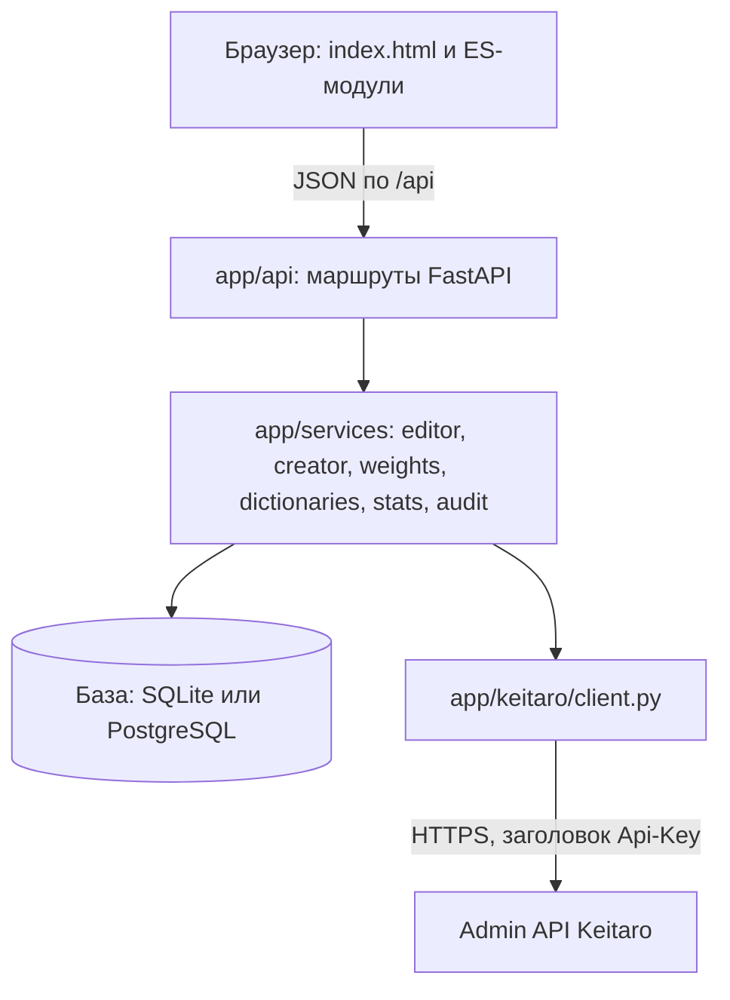
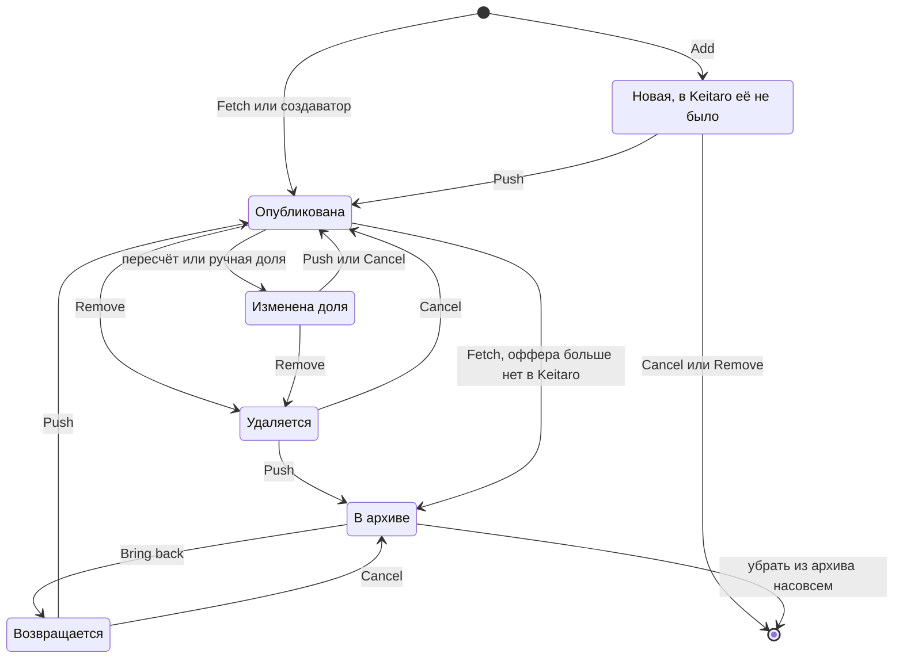
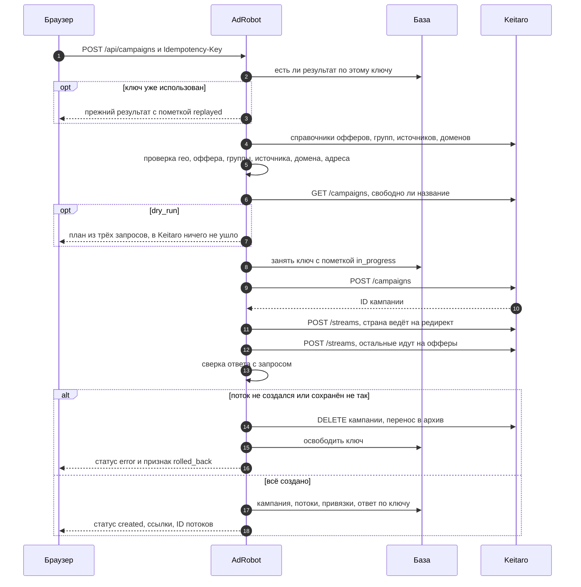
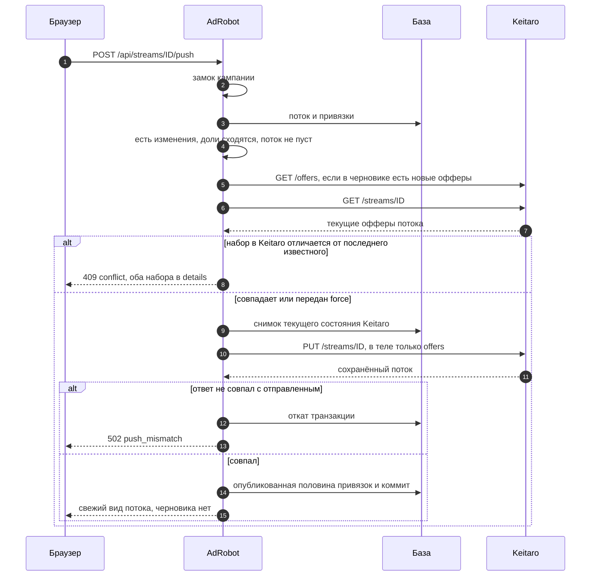

# Архитектура

Документ для того, кто будет читать код. Что умеет приложение, описано в [README](../README.md). Назначение каждой функции собрано в [FUNCTIONS.md](FUNCTIONS.md).

## Слои



| Слой | Где лежит | За что отвечает | Чего не делает |
|---|---|---|---|
| Интерфейс | `app/web/` | Рисует состояние, которое вернул сервер. Каждая кнопка вызывает один метод API | Не считает доли и не хранит черновик. Исключение одно: схема маршрута в форме создания прикидывает доли для показа |
| Маршруты | `app/api/` | Разбор запроса, замок кампании, запись в журнал, выбор представления | Не содержит бизнес-правил |
| Сервисы | `app/services/` | Вся логика: черновик, пересчёт, публикация, сага создания, справочники | Не знает про HTTP-ответы. Бросает `EditorError` и `CreatorError` |
| Клиент Keitaro | `app/keitaro/` | Запросы, повторы, разбор ошибок всех форматов, справочник стран | Не знает про базу и правила редактора |
| База | `app/models.py`, `alembic/` | Зеркало кампаний и потоков и всё, чего в Keitaro нет: черновик, архив, закрепления, снимки, журнал | Не хранит ключ API |

Общие объекты создаются один раз при старте в `app/main.py`: клиент, `DictionaryService`, `CampaignCreator`, `StreamLocks`. Маршруты получают их через зависимости из `app/api/deps.py`. Фабрика `create_app(settings, transport)` принимает подменный транспорт. Так тесты и демо-режим работают на эмуляторе без единого условия в боевом коде.

## Схема данных

Схему создаёт миграция `alembic/versions/20260918_0001_initial_schema.py`.

| Таблица | Смысл | Важные поля |
|---|---|---|
| `campaigns` | Кампания Keitaro, известная AdRobot | `keitaro_id` уникален. `origin` равен `adrobot` у созданных создаватором и `keitaro` у импортированных. `geo` заполняется только создаватором. `is_deleted` значит, что кампания пропала из трекера или ушла в архив. `streams_fetched_at` хранит время последнего Fetch |
| `streams` | Поток кампании | `keitaro_id` уникален. `schema` определяет редактируемость: офферы есть только у `landings`. `summary` хранит справку для показа, логика её не читает. `is_deleted` значит, что поток пропал из трекера |
| `stream_offers` | Привязка оффера к потоку, главная таблица логики | Уникальная пара `stream_id` и `offer_id`. Остальное описано ниже |
| `offers` | Кэш справочника офферов | Первичный ключ равен ID оффера в Keitaro. `is_missing` значит, что оффер был в справочнике, а в последней выдаче его нет |
| `stream_snapshots` | Снимок офферов потока в Keitaro перед публикацией | `offers` хранит список `{offer_id, share, state}`. На поток хранится 30 последних |
| `operations` | Журнал операций | `action`, `actor`, `status`, номера кампании и потока в Keitaro, `summary`, `details`, `error`, `duration_ms` |
| `idempotency_records` | Защита создания от дублей | Первичный ключ равен ключу идемпотентности. `request_hash` и сохранённый `response` |
| `app_settings` | Настройки из интерфейса | Пары ключ и значение для умолчаний создаватора |

Время везде хранится в UTC. Тип `UTCDateTime` возвращает время с поясом даже из SQLite, которая пояс теряет.

### Привязка оффера: две половины

У строки `stream_offers` две пары полей.

| Поля | Что значат | Кто меняет |
|---|---|---|
| `state`, `share`, `is_pinned` | Черновик: то, что пользователь видит в AdRobot | Add, Remove, Bring back, ручная доля, пересчёт, Cancel, откат, Fetch |
| `kt_state`, `kt_share`, `kt_binding_id` | Что опубликовано в Keitaro по последней синхронизации. `NULL` значит, что в трекере этой привязки нет | Только Fetch и успешный Push |

Состояний три. `active` участвует в ротации и в пересчёте. `disabled` значит, что оффер выключен в самом Keitaro: AdRobot передаёт его как есть и в расчёт не берёт. `removed` значит архив AdRobot: оффера нет в трекере, но его можно вернуть.

Поток жёлтый, когда половины расходятся хотя бы у одной привязки. Признак не хранится, он вычисляется свойством `StreamOffer.is_dirty`:

| Черновик | В Keitaro | Изменена? |
|---|---|---|
| `removed` | привязка есть | да, оффер исчезнет после Push |
| `removed` | привязки нет | нет, это спокойный архив |
| `active` или `disabled` | привязки нет | да, оффер появится после Push |
| `active` или `disabled` | привязка есть | да, если отличается состояние или доля |

Вычисляемый признак сам приходит в порядок. Добавил оффер и тут же убрал: поток снова чистый, хотя никто флаг не сбрасывал. У свойства есть SQL-двойник `DIRTY_BINDING` в `app/api/routes_campaigns.py`. Он ищет кампании с черновиками одним запросом.

Ещё два поля держат логику оригинала:

- `was_published` отвечает на вопрос, была ли привязка когда-нибудь в Keitaro. Cancel удаляет только те привязки, которых там не было. Так воспроизводится фраза из видео: «оффер останется, привязка удалится».
- `sort_index` хранит порядок активации. Новый оффер получает максимум плюс один. Оффер после Bring back тоже. По этому порядку раздаётся остаток от деления долей и строится тело Push. На экране порядок другой: по убыванию доли, при равенстве по `id` привязки. Поэтому возвращённый оффер встаёт на прежнее место в таблице, как в оригинале, а лишний процент достаётся ему.

Закрепление `is_pinned` в черновик не входит. Оно не делает поток жёлтым, не уходит в Keitaro и не откатывается кнопкой Cancel.

## Жизненный цикл привязки



Жёлтый поток дают состояния «Новая», «Изменена доля», «Удаляется» и «Возвращается». В интерфейсе они видны метками «новый», «вернётся», зачёркнутой прежней долей и серой строкой `removed`.

## Создание кампании: сага

Keitaro не даёт транзакций, а кампания состоит из трёх запросов. Поэтому сначала идут все проверки, а сбой после первого запроса компенсируется.



Детали, которых не видно на схеме:

- Проверки собирают все ошибки формы разом. Пользователь не чинит их по одной.
- Ключ занимается записью в базу до первого запроса в трекер. Два одновременных дубля упираются в уникальность первичного ключа, проходит один. При неудаче ключ освобождается, и попытку можно повторить с ним же.
- `POST` после таймаута не повторяется. Создалась ли кампания, неизвестно, и сообщение прямо просит проверить трекер.
- Случайный alias при ответе «уже занят» генерируется заново, до четырёх попыток. Alias, заданный пользователем, не подменяется.
- При `split_by_geo` каждая кампания создаётся отдельной сагой. Ответ приходит с кодом 200 и статусом по каждой кампании: часть может создаться, часть нет.
- Если не удалась даже компенсация, сообщение называет номер кампании и просит удалить её вручную.

## Push to KT



Почему так:

- **В теле только `offers`.** `PUT /streams/{id}` обновляет лишь присланные поля. Фильтры, лендинги, позиция и название потока не трогаются. Цикл «прочитать весь объект и отправить обратно» не нужен, а вместе с ним исчезает риск затереть чужие правки в других полях.
- **Конфликт ищется по содержимому.** Сравниваются отсортированные тройки `(offer_id, share, state)`: что лежит в трекере сейчас и что мы видели при последней синхронизации. На отметки времени опираться нельзя: удалённый из потока оффер следа не оставляет.
- **Сначала Keitaro, потом база.** Опубликованная половина записывается только после успешного ответа и сверки. При любой ошибке поток остаётся жёлтым, Push можно повторить. Повтор `PUT` безопасен: тот же набор офферов даёт тот же результат.
- **Снимок пишется в ту же транзакцию.** Не удалась публикация: нет и снимка.
- **Остаётся одно окно.** Если `PUT` прошёл, а коммит в нашу базу нет, трекер уже обновлён, а мы об этом не знаем. Следующий Push увидит расхождение и сообщит о конфликте. Fetch с сохранением черновика сведёт состояния: черновик совпадёт с трекером, поток станет белым.

## Fetch при черновике: трёхстороннее слияние

Fetch без черновика зеркалит Keitaro. Если черновик есть, интерфейс спрашивает, сохранить его или сбросить. При сохранении функция `_sync_bindings` решает судьбу каждой привязки отдельно. Три стороны: черновик, последнее известное состояние трекера и его текущее состояние.

| Оффер в Keitaro сейчас | Привязка у нас | Черновик сохраняем | Черновик сбрасываем |
|---|---|---|---|
| есть | нет | Создаётся с состоянием и долей из Keitaro | То же |
| есть | не тронута | Принимает состояние и долю Keitaro | То же |
| есть | изменена | Черновик остаётся, обновляется только опубликованная половина | Всё берётся из Keitaro |
| нет | не тронута | Уходит в архив: `removed`, 0 %, закрепление снято | То же |
| нет | изменена | Черновик остаётся, опубликованная половина очищается. После Push оффер появится в трекере заново | Была в Keitaro: уходит в архив. Не была: удаляется |
| нет | уже в архиве | Остаётся в архиве | То же |

Следствия:

- Доли при Fetch не пересчитываются никогда. После слияния сумма может оказаться не 100. Пример: закреплённый и потому нетронутый оффер принял новую долю из трекера. Поток покажет проблему, Push будет закрыт до нажатия «Пересчитать».
- После Fetch опубликованная половина свежая, поэтому следующий Push конфликта не увидит.
- Закрепления живут только у нас, Fetch их не трогает. Исключение: оффер, ушедший в архив.
- Поток, пропавший из трекера, помечается `is_deleted`, но не удаляется. Править его нельзя.

## Конкурентность

| Угроза | Защита |
|---|---|
| Двойной клик, две вкладки, два пользователя правят одну кампанию | `StreamLocks`: один asyncio-замок на кампанию. Под ним идут Fetch, каждая правка, Push и архивация. Пересчёты выполняются строго по очереди |
| Двойной клик по Create, повтор после обрыва связи | Ключ идемпотентности, занятый до первого запроса в трекер |
| Кто-то правит поток в админке Keitaro, пока у нас черновик | Сверка перед Push, код `conflict` |
| Слишком много запросов к трекеру разом | Семафор в клиенте, `KEITARO_MAX_CONCURRENCY`, по умолчанию 4 |
| Параллельная запись в SQLite | WAL, `busy_timeout` 5 секунд, внешние ключи включены |
| В автокомплите ответ на старый запрос пришёл позже нового | Интерфейс нумерует запросы и отбрасывает устаревшие ответы |
| Повторное нажатие кнопки во время операции | Кнопка блокируется до ответа сервера |

Замки и кэш справочников живут в памяти процесса, поэтому приложение рассчитано на один процесс. Для нескольких воркеров замок нужно вынести наружу, например в advisory lock PostgreSQL.

## Обработка ошибок

Сервисный слой бросает исключения с машинным кодом и русским текстом. Обработчики в `app/main.py` приводят всё к одному виду:

```json
{"error": {"code": "invalid_distribution", "message": "Сумма долей 66%, а должна быть 100%.", "details": null}}
```

| Исключение | Откуда | Статус |
|---|---|---|
| `EditorError` | Редактор | Задаётся в месте ошибки: 404, 409, 422, 502 |
| `CreatorError` | Создаватор | 409, 422, 502. Список проблем формы лежит в `details.errors` |
| `KeitaroError` и наследники | Клиент | 404, 422, 502, 503, 504, таблица есть в [FUNCTIONS.md](FUNCTIONS.md#appkeitaroerrorspy) |
| `RequestValidationError` | Схемы запросов | 422, код `validation` |
| `HTTPException` | В том числе проверка токена | Как задано, код `http_error` |
| `OperationalError` | База | 503, код `database_error`. Для несозданных таблиц текст подсказывает `alembic upgrade head` |
| Любое другое | Где угодно | 500, код `internal_error`. Подробности пишутся только в лог сервера |

Коды редактора: `campaign_not_found`, `stream_not_found`, `binding_not_found`, `snapshot_not_found`, `stream_deleted`, `stream_without_offers`, `offer_already_in_stream`, `offer_not_usable`, `already_removed`, `not_removed`, `not_active`, `not_archived`, `no_active_offers`, `nothing_to_push`, `empty_stream`, `invalid_distribution`, `conflict`, `push_mismatch`. К ним добавляются коды калькулятора: `not_enough_for_free`, `pinned_sum_mismatch`, `pinned_out_of_range`, `share_out_of_range`, `unknown_item`.

Коды создаватора: `validation`, `duplicate_name`, `idempotency_mismatch`, `in_progress`, `alias_taken`, `stream_creation_failed`, `verify_failed`, `bad_response`, `bad_redirect_url`.

Операции редактора и создаватора обёрнуты в `audited`. При ожидаемой ошибке он откатывает транзакцию, пишет запись в журнал со статусом `error` и передаёт исключение дальше. Поэтому неудачное добавление оффера не оставляет следов в базе, а в журнале видно, что и почему не получилось. Создание отвечает кодом 200 со статусами по кампаниям. Такая операция попадает в журнал как выполненная, а число ошибок стоит в её сводке.

Статистика падает мягко. Любая ошибка отчёта даёт `available: false`, в колонках появляется прочерк, редактор работает дальше. То же с названиями офферов после Fetch: сбой справочника Fetch не роняет.

Интерфейс разбирает особо несколько случаев: `conflict` открывает диалог с выбором, `duplicate_name` просит подтверждения, ответ 401 вызывает запрос токена. Остальное показывается тостом с текстом из `message`. В коде редактора есть и диалог подтверждения для `empty_stream`. До него дело не доходит: при пустом потоке кнопка Push выключена, публикация пустого потока доступна только через API.

## Решения и компромиссы

**Асинхронный SQLAlchemy.** Приложение почти всё время ждёт: ответ трекера или базу. Клиент Keitaro построен на асинхронном httpx. Один цикл событий обслуживает и сеть, и базу, потоки под синхронные вызовы не нужны. Замок кампании в этой модели становится обычным `asyncio.Lock`. Тот же код работает с SQLite через aiosqlite и с PostgreSQL через asyncpg. Цена: ленивых подгрузок нет, связи читаются явно через `selectinload`.

**Фронтенд без сборки.** Проверяющий клонирует репозиторий и запускает один процесс. Node, бандлер и шаг сборки не нужны. Строгий CSP получается сам собой: inline-скриптов нет, сторонних доменов нет. Кода немного, около 1300 строк JavaScript. DOM собирает помощник `h()` из `app/web/static/js/dom.js`. Текст он вставляет только как текст, поэтому название оффера с тегами не станет разметкой. Цена: нет типов и готовых компонентов, автокомплит и диалоги написаны руками.

**SQLite по умолчанию.** Ставить ничего не нужно, база лежит в одном файле, проверка занимает минуты. Приложение рассчитано на один процесс, и ему этого хватает. Режим WAL снимает блокировку читателей. PostgreSQL включается сменой `DATABASE_URL`, схема и запросы общие.

**Черновик в базе, а не в браузере.** Он переживает перезагрузку страницы и виден всем, кто открыл кампанию. На нём строятся Cancel, откат и журнал. Модель с двумя половинами привязки делает признак «есть изменения» вычисляемым.

**Кэш офферов в таблице.** У `GET /offers` нет ни поиска, ни страниц, он отдаёт список целиком. Автокомплит ищет по нашей таблице. Она обновляется, когда кэш устарел, и принудительно, если оффера в ней не нашлось. Отличие от оригинала: там каждый поиск шёл в API трекера. Новый оффер станет виден с задержкой до `DICTIONARY_TTL_SECONDS`.

**Проверки на нашей стороне.** Keitaro принимает без ошибки несуществующие ID, любые строки вместо кодов стран и любую сумму долей. Тихая ошибка в трекере стоит денег, поэтому всё, что он пропустил бы, проверяется до отправки. Список наблюдений лежит в [KEITARO_API_NOTES.md](KEITARO_API_NOTES.md).

**Русские тексты и машинные коды.** Сообщение читает человек, код читает программа. Интерфейс не разбирает текст: он смотрит на `code` и `details`.

**Эмулятор вместо моков.** `tests/fake_keitaro.py` подменяет сеть целиком и ведёт себя как трекер. Он сохраняет ID привязки по `offer_id`, схлопывает дубли, не проверяет суммы, отвечает ошибками трёх форматов. Тесты идут через настоящие маршруты, сервисы и базу. Сбои включаются одной строкой `fail_next(...)`. Этот же эмулятор питает демо-режим.
